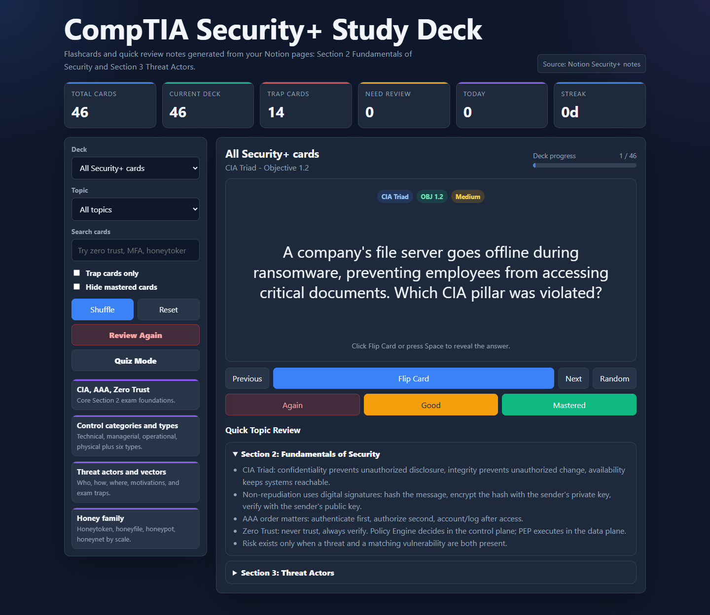
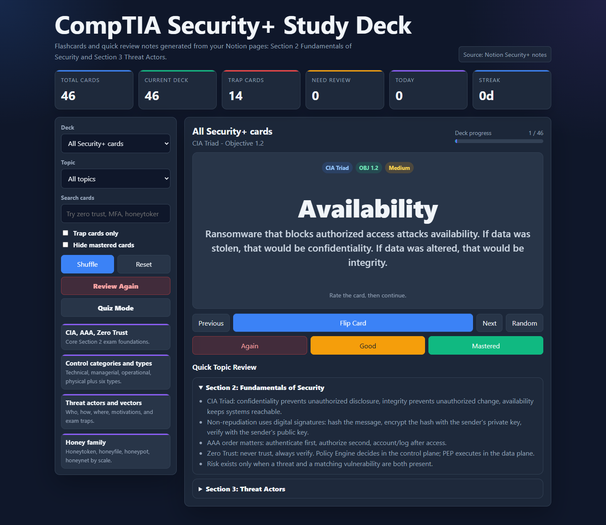
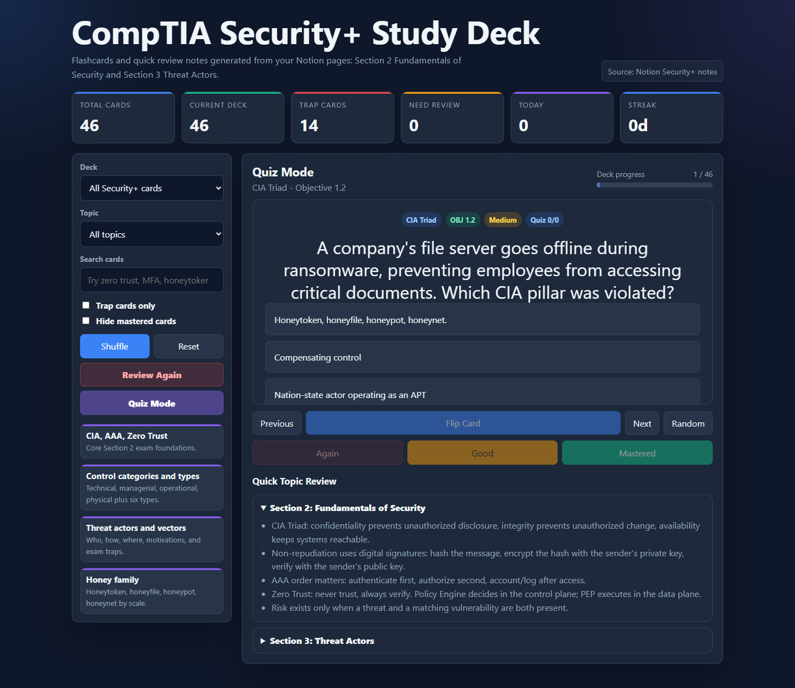
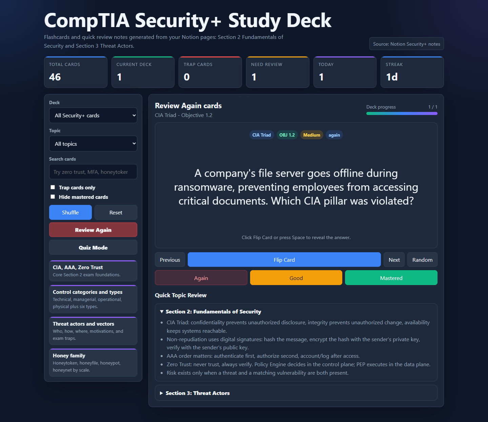

# Security+ Flashcards

An interactive CompTIA Security+ study deck built from personal study notes in Notion. The project turns exam notes into searchable flashcards with deck filters, trap-card review, missed-card practice, quiz mode, progress tracking, and a polished dark dashboard interface.

## Live Demo

[Open the live Security+ flashcard app](https://beantown3.github.io/security-plus-flashcards/)

## Screenshots

### Dashboard

### Answer View

### Quiz Mode

### Review Again Mode

## Why I Built This

I am studying cybersecurity and wanted a project that helps me learn while also showing practical technical growth. This app is part study tool, part portfolio project: it demonstrates how I can organize security concepts, turn notes into a usable web app, and use AI as a coding partner while still understanding and explaining the result.

## Features

- 46 flashcards based on CompTIA Security+ notes
- Deck filters for Section 2: Fundamentals of Security and Section 3: Threat Actors
- Clickable topic shortcuts for high-level review areas
- Topic and keyword search
- Trap-card mode for high-mistake exam scenarios
- Flip-card interaction with bold centered answer formatting
- Shuffle and random-card practice
- Again / Good / Mastered ratings
- Dedicated Review Again mode for missed cards
- Multiple-choice quiz mode with score tracking
- Daily reviewed-card count and study streak tracking
- Browser local storage for review progress
- Offline-friendly single-page HTML app

## Topics Covered

- CIA Triad
- Non-repudiation
- Authentication, Authorization, and Accounting
- Risk, threats, and vulnerabilities
- Security control categories and types
- Gap analysis
- Zero Trust architecture
- Threat actors
- Threat vectors and attack surfaces
- Insider threats and Shadow IT
- Supply chain attacks
- Bluetooth and wired-network attack vectors
- Honeypots, honeynets, honeyfiles, and honeytokens
- Social engineering concepts such as BEC, smishing, watering hole attacks, and typosquatting

## Built With

- HTML
- CSS
- JavaScript
- Notion notes as the study source
- GitHub Pages for hosting
- AI-assisted development with Codex

## How To Use

Open the [live demo](https://beantown3.github.io/security-plus-flashcards/) or open `index.html` locally in a browser. No build tools or server are required.

Use the deck dropdown to choose a section, click a topic shortcut, search for a term, flip cards to reveal answers, and rate cards as you study. Cards marked **Again** appear in the Review Again mode for focused practice.

## What I Learned

- How to turn study notes into an interactive web app
- How to organize a small frontend project for a GitHub portfolio
- How browser `localStorage` can save progress without a backend
- How GitHub Pages can publish a static website
- How AI can help build a project while I continue learning the code and concepts

## Troubleshooting Case Study

I documented an evidence-driven, AI-assisted investigation into a Windows sandbox permission failure encountered while preparing this project for LinkedIn. The case study covers hypothesis testing, log and ACL analysis, least-privilege remediation, validation, and an interview-ready STAR summary.

[Read the Windows sandbox incident case study](docs/codex-browser-sandbox-case-study.md)

## Project Goals

- Build a real study tool while preparing for Security+
- Practice creating portfolio-ready cybersecurity projects
- Learn how to structure and explain a small web app
- Keep improving the deck as new study sections are added

## Future Improvements

- Add more Security+ chapters from Notion
- Move flashcard data into a separate `cards.json` file
- Split the project into separate `style.css` and `app.js` files
- Add import/export for progress
- Add charts for quiz scores and study history
- Improve mobile layout polish

## Notes

This is a personal study project and is not affiliated with CompTIA. CompTIA Security+ is a certification from CompTIA.
