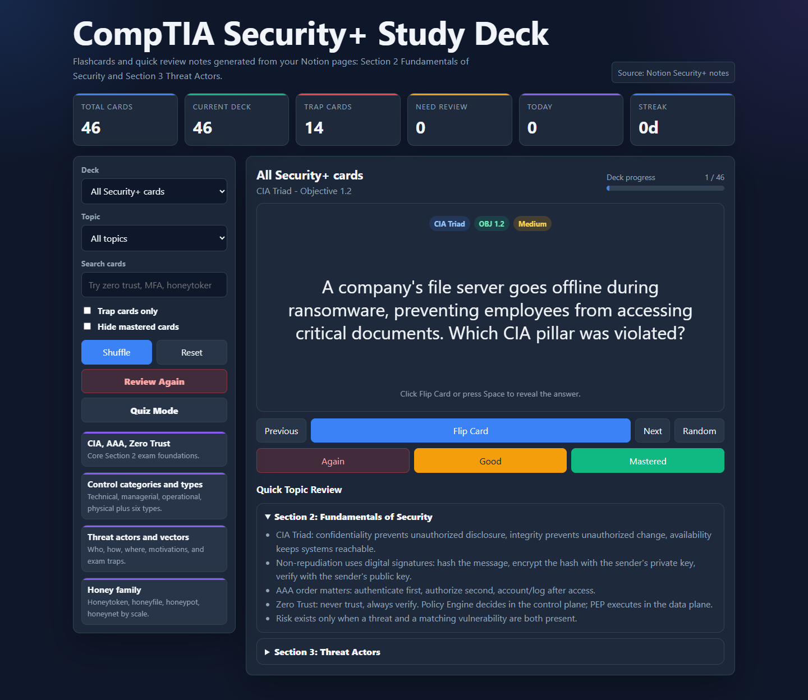
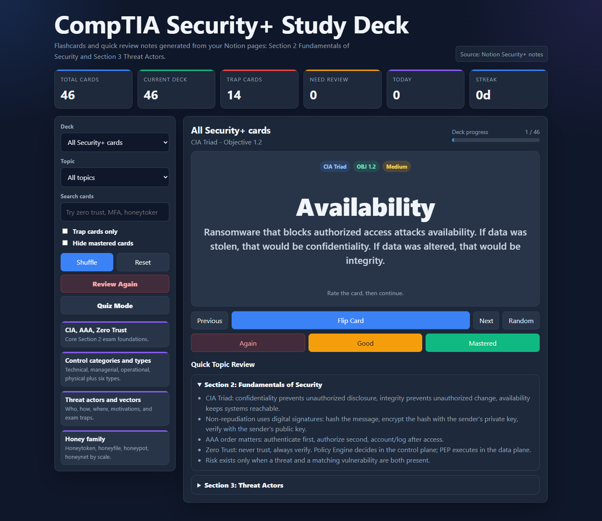
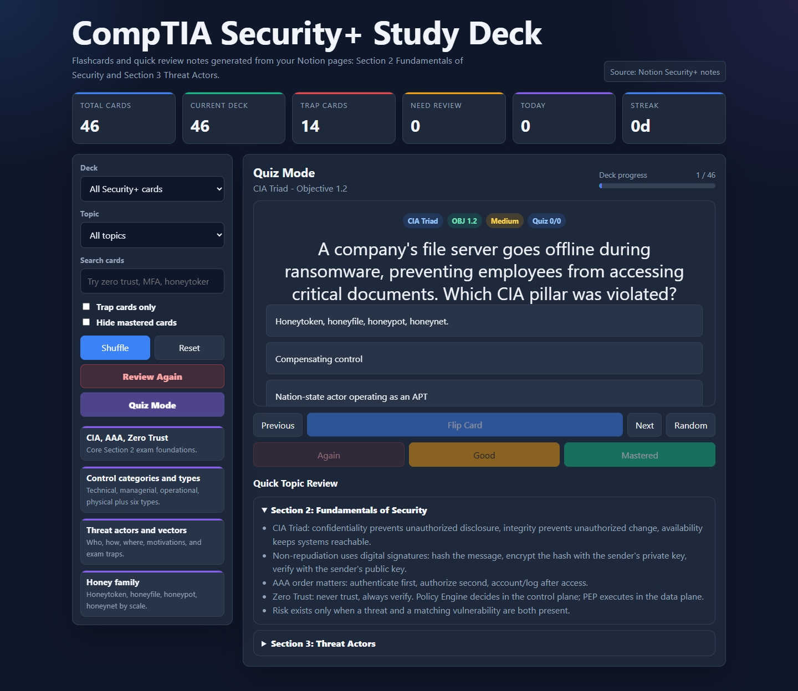
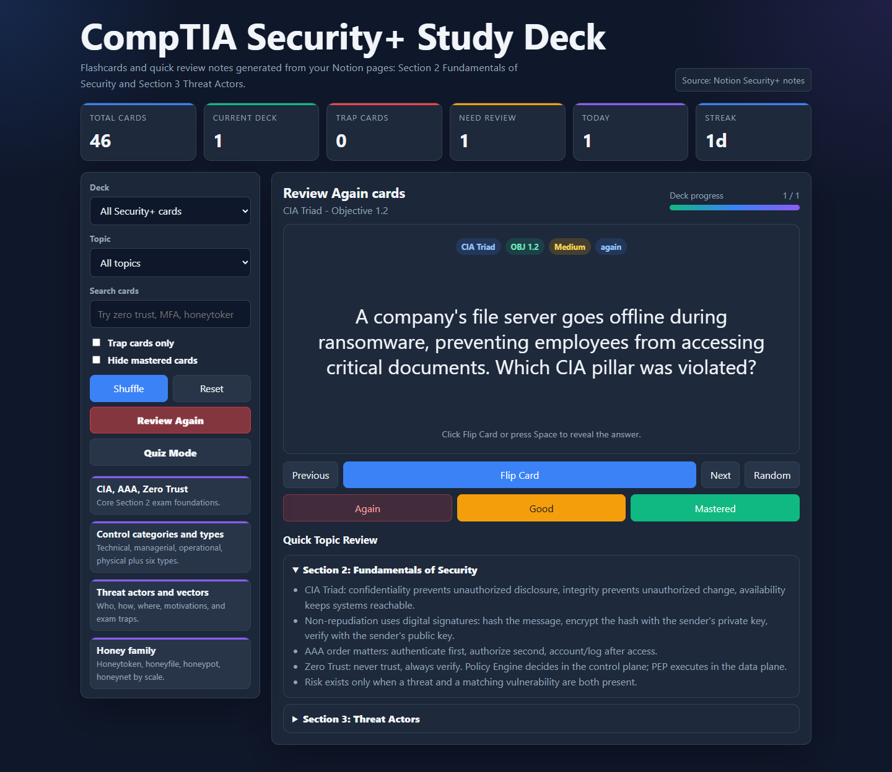

# Security+ Flashcards

An interactive CompTIA Security+ study deck built from personal study notes in Notion. The project turns exam notes into searchable flashcards with deck filters, trap-card review, missed-card practice, quiz mode, audio review, progress tracking, and a polished dark dashboard interface.

The repo also includes **Cipher Quest**, a dark mobile-friendly cryptography learning game for Security+ Section 8.

## Live Demo

[Open the live Security+ flashcard app](https://beantown3.github.io/security-plus-flashcards/)

[Open Cipher Quest](https://beantown3.github.io/security-plus-flashcards/cipher-quest/?version=bc44062)

## Screenshots

### Dashboard

### Answer View

### Quiz Mode

### Review Again Mode

## Why I Built This

I am studying cybersecurity and wanted a project that helps me learn while also showing practical technical growth. This app is part study tool, part portfolio project: it demonstrates how I can organize security concepts, turn notes into a usable web app, and use AI as a coding partner while still understanding and explaining the result.

## Features

- 123 flashcards based on CompTIA Security+ notes
- Deck filters for Sections 2-8
- Clickable topic shortcuts for high-level review areas
- Topic and keyword search
- Trap-card mode for high-mistake exam scenarios
- Flip-card interaction with bold centered answer formatting
- Shuffle and random-card practice
- Again / Good / Mastered ratings
- Dedicated Review Again mode for missed cards
- Multiple-choice quiz mode with score tracking
- Audio review mode for hands-free study
- Daily reviewed-card count and study streak tracking
- Browser local storage for review progress
- Offline-friendly single-page HTML app

## Cipher Quest

Cipher Quest is a responsive cryptography learning game focused on Security+ Section 8. I redesigned the original prototype into a calmer, adaptive study experience that breaks dense material into short rounds and provides immediate reinforcement after every answer.

[Play Cipher Quest](https://beantown3.github.io/security-plus-flashcards/cipher-quest/?version=bc44062)

[Read the Cipher Quest project details](cipher-quest/README.md)

### Cipher Quest Highlights

- 35-question Practice mode
- Eight-question Five-Minute Review
- Ten-question comparison round for commonly confused concepts
- Six difficult, original Security+-style Boss Mode scenarios
- Green correct blocks, red review blocks, and a yellow current block
- Clickable completed blocks for reviewing previous questions
- Full definitions, reasoning, comparisons, and memory hooks after each answer
- Full terminology paired with abbreviations, such as Hardware Security Module (HSM)
- 68 vocabulary terms organized into eight smaller learning zones
- Missed-question retry and browser-based session restoration
- Responsive layouts tested for desktop, large iPad Pro, and iPhone screens
- Dark, minimalist interface with a custom pixel-style character

## Topics Covered

- CIA Triad
- Non-repudiation
- Authentication, Authorization, and Accounting
- Risk, threats, and vulnerabilities
- Security control categories and types
- Gap analysis
- Zero Trust architecture
- Threat actors
- Threat vectors and attack surfaces
- Insider threats and Shadow IT
- Supply chain attacks
- Bluetooth and wired-network attack vectors
- Honeypots, honeynets, honeyfiles, and honeytokens
- Social engineering concepts such as BEC, smishing, watering hole attacks, and typosquatting
- Malware concepts such as ransomware, botnets, rootkits, fileless malware, and compromise indicators
- Data protection concepts such as classification, ownership, data states, sovereignty, tokenization, masking, and DLP
- Cryptographic solutions such as symmetric encryption, asymmetric encryption, hashing, PKI, certificates, TPM, HSM, and downgrade attacks

## Built With

- HTML
- CSS
- JavaScript
- Notion notes as the study source
- GitHub Pages for hosting
- AI-assisted development with Codex

## AI-Assisted Development Approach

I used Codex as a coding and testing partner while I acted as the product owner and subject-matter learner. I supplied the study notes, identified usability problems through hands-on testing, defined the learning behavior, reviewed each iteration, and requested corrections when the interface did not reinforce the material clearly enough.

The development workflow included:

- Translating learner feedback into specific interface requirements
- Auditing dense study notes and prioritizing essential concepts
- Designing active-recall, comparison, review, and scenario modes
- Testing correct, incorrect, retry, and saved-session behavior
- Checking responsive layouts at desktop, tablet, and phone sizes
- Using Git commits to preserve the evolution from prototype to redesign

This is intentionally described as **AI-assisted development** rather than claiming the code was written without assistance.

## How To Use

Open the [live demo](https://beantown3.github.io/security-plus-flashcards/) or open `index.html` locally in a browser. No build tools or server are required.

Use the deck dropdown to choose a section, click a topic shortcut, search for a term, flip cards to reveal answers, and rate cards as you study. Cards marked **Again** appear in the Review Again mode for focused practice.

## What I Learned

- How to turn study notes into an interactive web app
- How to organize a small frontend project for a GitHub portfolio
- How browser `localStorage` can save progress without a backend
- How GitHub Pages can publish a static website
- How AI can help build a project while I continue learning the code and concepts
- How to evaluate an early prototype, report specific usability failures, and turn them into testable acceptance criteria
- Why certification practice should progress from recognition to comparison and unfamiliar scenario application

## Troubleshooting Case Study

I documented an evidence-driven, AI-assisted investigation into a Windows sandbox permission failure encountered while preparing this project for LinkedIn. The case study covers hypothesis testing, log and ACL analysis, least-privilege remediation, validation, and an interview-ready STAR summary.

[Read the Windows sandbox incident case study](docs/codex-browser-sandbox-case-study.md)

## Project Goals

- Build a real study tool while preparing for Security+
- Practice creating portfolio-ready cybersecurity projects
- Learn how to structure and explain a small web app
- Keep improving the deck as new study sections are added

## Future Improvements

- Add more Security+ chapters from Notion
- Add additional reworded question variants for spaced review
- Add progress summaries by cryptography learning zone
- Expand Boss Mode with more performance-based question-style activities
- Move flashcard data into a separate `cards.json` file
- Split the project into separate `style.css` and `app.js` files
- Add import/export for progress
- Add charts for quiz scores and study history
- Improve mobile layout polish

## Notes

This is a personal study project and is not affiliated with CompTIA. CompTIA Security+ is a certification from CompTIA.
